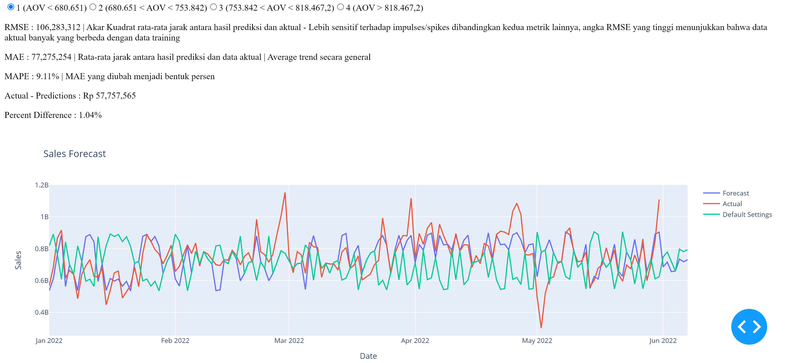

# README

# Project Title

Sales Forecasting

---

# Demo-Preview



Figure 3: Gambar Layout Dash App Sementara Ini

---

# Table of contents
- [README](#readme)
- [Project Title](#project-title)
- [Demo-Preview](#demo-preview)
- [Table of contents](#table-of-contents)
- [Installation](#installation)
- [Running](#running)
- [Usage](#usage)

---

# Installation

- Install docker

---

# Running

```docker
docker-compose up --build
```

---

# Usage

- Forecast Weekly Sales
- Allow users to change metric variables to see its effect on sales. Used to help users decide on marketing strategies to use.