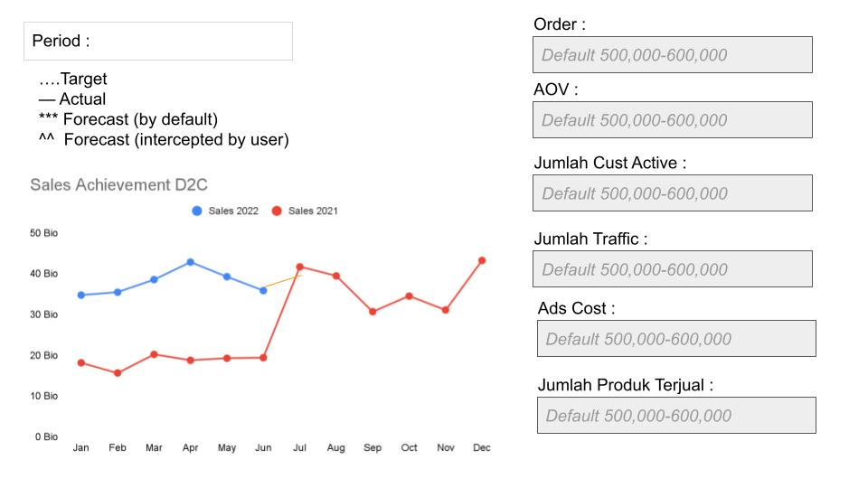
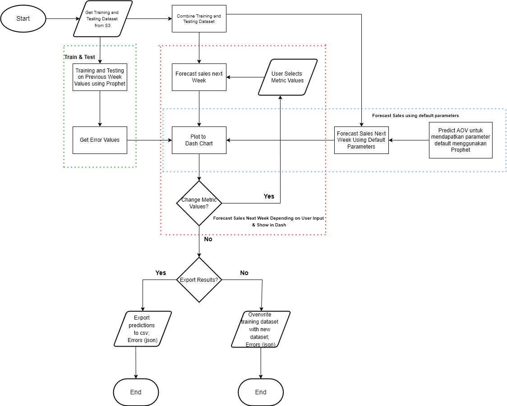
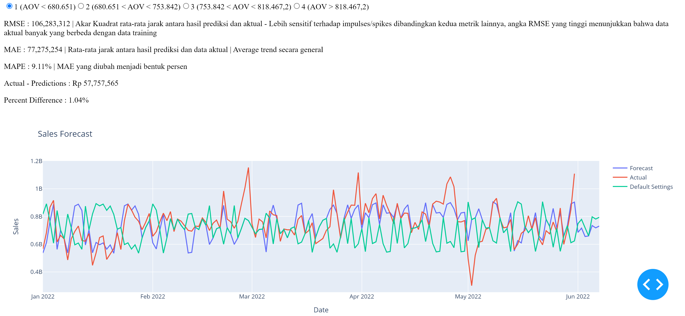

# IBP Sales Forecasting Documentation

---

# Table of Contents
- [IBP Sales Forecasting Documentation](#ibp-sales-forecasting-documentation)
- [Table of Contents](#table-of-contents)
- [Tujuan Projek](#tujuan-projek)
- [Data yang Digunakan](#data-yang-digunakan)
- [Library yang digunakan — in requirements.txt](#library-yang-digunakan--in-requirementstxt)
- [Model yang digunakan](#model-yang-digunakan)
- [Output](#output)
- [Project Flow](#project-flow)
  - [Pipeline](#pipeline)
    - [**Get the training dataset and the testing dataset (updated weekly from s3)**](#get-the-training-dataset-and-the-testing-dataset-updated-weekly-from-s3)
    - [**Rename column sesuai dengan kaidah penamaan prophet**](#rename-column-sesuai-dengan-kaidah-penamaan-prophet)
    - [**Menggabungkan training and testing dataset untuk menghasilkan forecasting dataset**](#menggabungkan-training-and-testing-dataset-untuk-menghasilkan-forecasting-dataset)
    - [Membuat feature AOV](#membuat-feature-aov)
    - [Membuat Feature AOV yang bersifat kategorik](#membuat-feature-aov-yang-bersifat-kategorik)
    - [Memprediksi AOV untuk 7 hari kedepan menggunakan Prophet dan menggabungkan hasil prediksi dengan data aktual](#memprediksi-aov-untuk-7-hari-kedepan-menggunakan-prophet-dan-menggabungkan-hasil-prediksi-dengan-data-aktual)
    - [Melakukan weekly forecasting dengan default parameters (AOV hasil prediksi)](#melakukan-weekly-forecasting-dengan-default-parameters-aov-hasil-prediksi)
    - [Melakukan training and testing model untuk mendapatkan error values](#melakukan-training-and-testing-model-untuk-mendapatkan-error-values)
    - [Membuat list yang berisi value aov kategorik ditambah 7 placeholder values bernilai 0 yang akan digunakan untuk forecasting yang diintercept user](#membuat-list-yang-berisi-value-aov-kategorik-ditambah-7-placeholder-values-bernilai-0-yang-akan-digunakan-untuk-forecasting-yang-diintercept-user)
  - [Forecasting Dash App](#forecasting-dash-app)
    - [Imports](#imports)
    - [Data](#data)
    - [Layout](#layout)
    - [Callback](#callback)
    - [Function Update Graph](#function-update-graph)

---

# Tujuan Projek

1. Forecast sales dengan timeframe weekly
2. Allow user untuk memilih value-value pada beberapa metrik untuk melihat pengaruhnya terhadap sales

# Data yang Digunakan

- Data traffic diambil dari mixpanel dengan column:
    - event_date
    - session_start_count — Jumlah Traffic
- Data sales dan metric diambil dari dataset ‘ (ATH) Sales Order Main Dataset V2’ di quicksight
    - Column yang diambil:
        - order_date
        - sales_total — Jumlah Sales
        - total_order — Jumlah order
        - qty — Jumlah produk terjual
- Granularity yang digunakan adalah Daily

# Library yang digunakan — in requirements.txt

- numpy
- pandas
- plotly
- jdata
- scikit-learn
- json
- matplotlib
- pystan==2.19.1.1
- prophet
- dash

# Model yang digunakan

- Model yang digunakan adalah Prophet dengan regressors yang berupa metrik-metrik yang akan dimanipulasi
- Metrik-Metrik yang digunakan adalah:
    - Jumlah order
    - Jumlah produk terjual
    - Jumlah traffic
    - Average Order Value (AOV)
    - Jumlah Active Customer

# Output

- Output dari projek ini adalah sebuah dash app yang menunjukkan:
    - Grafik hasil forecast dengan default values
    - Grafik data aktual
    - Grafik target
    - Grafik hasil forecast dengan values yang dimanipulasi user
    - RMSE, MAE , MAPE, Actual Difference, dan Percent Difference yang didapat dari dilakukannya testing pada data minggu lalu
    - Total Sales untuk Minggu depan
        
        
        
        Figure 1: Contoh UI Dash App Sales Forecasting
        

# Project Flow



Figure 2: Flow Chart Project Sales Forecasting

## Pipeline

- Imports
    
    ```python
    import pandas as pd
    from prophet import Prophet
    import numpy as np
    import jdata as jd
    from sklearn.metrics import mean_squared_error, mean_absolute_error
    import matplotlib.pyplot as plt
    import json
    ```
    

### **Get the training dataset and the testing dataset (updated weekly from s3)**

### **Rename column sesuai dengan kaidah penamaan prophet**

```python
def wrangle(path):
    df_tmp = pd.read_csv(path)
    df_tmp['order_date'] =  pd.to_datetime(df_tmp['order_date'])
    df_tmp.sort_values(by='order_date')
    df_tmp.reset_index(drop=True)
    df_tmp.rename(columns = {'order_date':'ds', 'sales_total':'y'}, inplace = True)
    return df_tmp
```

**Parameters:**

**path**    :    ***str, path object or file-like object***

path untuk sebuah file csv

**Returns:**

**df_tmp    :   *Pandas* *DataFrame***

dataframe yang telah diformatkan sesuai dengan kaidah penamaan prophet

---

### **Menggabungkan training and testing dataset untuk menghasilkan forecasting dataset**

```python
def append_df(df1,df2):
    df3 = df1.append(df2, ignore_index=True)
    return df3
```

**Parameters:**

**df1**    :    ***Pandas DataFrame***

dataframe training

**df2    :    *Pandas DataFrame***

dataframe testing

**Returns:**

**df3    :    *Pandas DataFrame, csv***

dataframe untuk forecast

---

### Membuat feature AOV

```python
def add_aov(df):
    df['AOV'] = df['y']/df['total_order']
```

**Parameters:**

**df    :    *Pandas DataFrame***

dataframe yang ingin ditambahkan feature AOV

**Returns:** 

**df[’AOV’]    :    *Pandas Column***

Column AOV yang dibuat dengan rumus $\frac{total\:sales}{total\:order}$ 

---

### Membuat Feature AOV yang bersifat kategorik

```python
def aov_range(x):
    #Dibagi 4 Quartile, Q3 dibuang
    if x <= 6.806514e+05:
        return 'low'
    elif 6.806514e+05 < x <= 7.538420e+05:
        return 'medium'
    elif 7.538420e+05< x <= 8.184672e+05:
        return 'medium-high'
    elif x > 8.184672e+05:
        return 'high'
```

- Membagi AOV menjadi 4 kategori
    - Kategori low    :    AOV < 680.651
    - Kategori medium    :    680.651 ≤ AOV < 753.842
    - Kategori medium-high    :    753.842 < AOV < 818.467
    - Kategori high    :    AOV > 818.467

**Parameters:**

**x    :    *float***

AOV value

**Returns:**

**‘low’, ’medium’, ’medium-high’, ’high’**    :    ***string***

The category that AOV value belongs to

---

```python
    
def nambah_aov(df):
    df['aov_kategorik'] = df['AOV'].apply(lambda x: aov_range(x))
    return df
```

- Membuat column dari output function aov_range

**Parameters:**

**df    :    *Pandas DataFrame***

Dataframe yang ingin dibuat column aov kategorik

**Returns:**

**df    :    *Pandas DataFrame***

Dataframe yang telah ditambahkan column aov kategorik

---

```python
def encode(df):
    df["aov_kategorik"] = df["aov_kategorik"].astype('category')
    df = pd.get_dummies(df,columns=['aov_kategorik'])
    return df
```

- One Hot Encode column aov_kategorik

**Parameters:**

**df    :    *Pandas DataFrame***

DataFrame yang memiliki column aov_kategorik

**Returns:**

**df    :    *Pandas DataFrame***

DataFrame yang telah ditambahkan aov_kategorik yang telah melalui one hot encoder

---

### Memprediksi AOV untuk 7 hari kedepan menggunakan Prophet dan menggabungkan hasil prediksi dengan data aktual

```python
def process_df_aov_forecast(df):
    df_def = df[['ds','AOV']]
    df_def = df_def.rename(columns = {'AOV': 'y'})
    mod = Prophet()
    mod.fit(df_def)
    fut_aov = mod.make_future_dataframe(periods = 7, freq = 'D')
    forecast_aov = mod.predict(fut_aov)
    forecast_aov = pd.DataFrame(forecast_aov['yhat'].iloc[-7:])
    forecast_aov = forecast_aov.rename(columns = {'yhat':'AOV'})
    forecast_aov = nambah_aov(forecast_aov)
    forecast_aov = encode(forecast_aov)
    if 'aov_kategorik_low' not in list(forecast_aov.columns):
        forecast_aov['aov_kategorik_low'] = np.zeros(7, dtype=int)
    if 'aov_kategorik_medium' not in list(forecast_aov.columns):
        forecast_aov['aov_kategorik_medium'] = np.zeros(7, dtype=int)
    if 'aov_kategorik_medium-high' not in list(forecast_aov.columns):
        forecast_aov['aov_kategorik_medium-high'] = np.zeros(7, dtype=int)
    if 'aov_kategorik_high' not in list(forecast_aov.columns):
        forecast_aov['aov_kategorik_high'] = np.zeros(7, dtype=int)
    low = df['aov_kategorik_low'].tolist() + forecast_aov['aov_kategorik_low'].tolist()
    medium = df['aov_kategorik_medium'].tolist() + forecast_aov['aov_kategorik_medium'].values.tolist()
    med_high = df['aov_kategorik_medium-high'].tolist() + forecast_aov['aov_kategorik_medium-high'].values.tolist()
    high = df['aov_kategorik_high'].tolist() + forecast_aov['aov_kategorik_high'].values.tolist()
    return low,medium,med_high,high
```

- Jika tidak ada sebuah kategori dari hasil prediksi maka dibuat list dengan length 7 berisi angka 0 sebagai placeholder

**Parameters:**

**df    :    *Pandas DataFrame***

DataFrame Forecast yang memiliki value AOV

**Returns:**

**low    :    *list***

List berisi Binary Value (0,1) yang menandakan apakah AOV pada hari tersebut termasuk kategori low dari awal timeframe DataFrame hingga 7 hari sehabis tanggal terakhir di dataframe forecasting

**medium    :    *list***

List berisi Binary Value (0,1) yang menandakan apakah AOV pada hari tersebut termasuk kategori medium dari awal timeframe DataFrame hingga 7 hari sehabis tanggal terakhir di dataframe forecasting

**med_high    :    *list***

List berisi Binary Value (0,1) yang menandakan apakah AOV pada hari tersebut termasuk kategori medium-high dari awal timeframe DataFrame hingga 7 hari sehabis tanggal terakhir di dataframe forecasting

**high    :    *list***

List berisi Binary Value (0,1) yang menandakan apakah AOV pada hari tersebut termasuk kategori high dari awal timeframe DataFrame hingga 7 hari sehabis tanggal terakhir di dataframe forecasting

---

### Melakukan weekly forecasting dengan default parameters (AOV hasil prediksi)

```python
def model_forecast_default(df,aov_high,aov_medium,aov_low):
    num_days = 7
    m = Prophet()
    m.add_regressor('aov_kategorik_high')
    m.add_regressor('aov_kategorik_medium')
    m.add_regressor('aov_kategorik_low')
    model = m.fit(df)
    fut = m.make_future_dataframe(periods=num_days,freq='D')
    fut['aov_kategorik_high'] = aov_high
    fut['aov_kategorik_medium'] = aov_medium
    fut['aov_kategorik_low'] = aov_low
    forecast = m.predict(fut)
    forecast = forecast[['ds','yhat']]
    return forecast
```

**Parameters:**

**df    :    *Pandas DataFrame***

DataFrame untuk forecasting

**aov_high    :    *Pandas Series; Numpy Array; List***

Pandas series berisi Binary Value (0,1) yang menandakan apakah AOV pada hari tersebut termasuk kategori high dari awal timeframe DataFrame hingga 7 hari sehabis tanggal terakhir di dataframe forecasting

**aov_medium    :    *Pandas Series; Numpy Array; List***

Pandas series berisi Binary Value (0,1) yang menandakan apakah AOV pada hari tersebut termasuk kategori medium dari awal timeframe DataFrame hingga 7 hari sehabis tanggal terakhir di dataframe forecasting

**aov_low    :    *Pandas Series; Numpy Array; List***

Pandas series berisi Binary Value (0,1) yang menandakan apakah AOV pada hari tersebut termasuk kategori low dari awal timeframe DataFrame hingga 7 hari sehabis tanggal terakhir di dataframe forecasting

**Returns:**

**forecast    :    *Pandas DataFrame, csv***

Pandas DataFrame yang berisi tanggal dan sales hasil forecast

---

### Melakukan training and testing model untuk mendapatkan error values

```python
def mape(y_true,y_pred):
    y_true, y_pred = np.array(y_true), np.array(y_pred)
    return np.mean(np.abs((y_true-y_pred)/ y_true)) *100
```

**Parameters:**

**y_true    :    *Pandas Series, Numpy Array***

Actual values of a variabel. i.e. Sales

**y_pred    :    *Pandas Series, Numpy Array***

Predicted values of a variabel. i.e. Sales

**Returns:**

**MAPE Value   :   *float***

Mean Absolute Percentage Value according to this formula: $\frac{\sum_{i=1}^{n}\Big|\frac{y_{prediction}-y_{actual}}{y_{actual}}\Big|}{n}\times100$

---

```python
def model_train_test(df1,df2,df3):
    mod = Prophet()
    mod.add_regressor('aov_kategorik_high')
    mod.add_regressor('aov_kategorik_medium')
    mod.add_regressor('aov_kategorik_low')
    model_prophet = mod.fit(df1)
    fut = mod.make_future_dataframe(periods = 7,freq='D')
    fut['aov_kategorik_high'] = df3['aov_kategorik_high']
    fut['aov_kategorik_medium'] = df3['aov_kategorik_medium']
    fut['aov_kategorik_low'] = df3['aov_kategorik_low']
    forecast = mod.predict(fut)
    predictions = forecast['yhat'].iloc[-7:]
    rmse_result = mean_squared_error(df2.y, predictions, squared = False)
    mae_result = mean_absolute_error(df2.y, predictions)
    mape_result = mape(df2.y, predictions)
    diff = sum(df2.y) - sum(predictions)
    percent_diff = abs(sum(df2.y) - sum(predictions))/sum(df2.y) *100
    metrics = {"RMSE": rmse_result,"MAE": mae_result,"MAPE": mape_result, 'Actual - Predictions': diff, 'Percent Difference': percent_diff}
    print('Performance Metrics:')
    print('RMSE: ',rmse_result)
    print('MAE:  ', mae_result)
    print('MAPE: ', mape_result)
    print('-----------------------')
    print('Difference in Testing (Aggregate Weekly)')
    print(f'Aktual - Prediksi: {diff}')
    print(f'Percent Difference: {percent_diff}')
    with open('metric.json', 'w') as fp:
        json.dump(metrics, fp)
```

**Parameters:**

**df1    :    *Pandas DataFrame***

DataFrame Training

**df2    :    *Pandas DataFrame***

DataFrame Testing

**df3    :    Pandas DataFrame**

DataFrame Forecasting

**Returns:**

**metrics   :    *json***

json containing error values.

- The error values are:
    - $RMSE = \sqrt{\frac{\Sigma_{i=1}^{n}{(y_{actual} -y_{predictions})^2}}{n}}$
    - $MAE = \frac{\sum_{i=1}^{n}|y_{prediction}-y_{actual}|}{n}$
    - $MAPE = \frac{\sum_{i=1}^{n}\Big|\frac{y_{prediction}-y_{actual}}{y_{actual}}\Big|}{n}\times100$
    - $Actual - Predictions = {\sum_{i=1}^{n}y_{actual}}-{\sum_{i=1}^{n}y_{predictions}}$
    - $Percent\:Difference = \frac{|{\sum_{i=1}^{n}y_{actual}}-{\sum_{i=1}^{n}y_{predictions}}|}{\sum_{i=1}^{n}y_{actual}} \times 100$

---

### Membuat list yang berisi value aov kategorik ditambah 7 placeholder values bernilai 0 yang akan digunakan untuk forecasting yang diintercept user

```python
def add_aov_kategorik(df):
    num_days = 7
    zeros = pd.Series(np.zeros(num_days))
    s_low = df['aov_kategorik_low']
    s_medium = df['aov_kategorik_medium']
    s_medium_high = df['aov_kategorik_medium-high']
    s_high = df['aov_kategorik_high']
    aov_low = pd.concat([s_low, zeros],ignore_index=True)
    aov_medium = pd.concat([s_medium, zeros],ignore_index=True)
    aov_med_high = pd.concat([s_medium_high, zeros],ignore_index=True)
    aov_high = pd.concat([s_high, zeros],ignore_index=True)
    return aov_low,aov_medium,aov_med_high,aov_high
```

**Parameters:**

**df    :    *Pandas DataFrame***

DataFrame Forecasting

**Returns:**

**aov_low    :    *Pandas Series; Numpy Array; List, csv***

Pandas series berisi Binary Value (0,1) yang menandakan apakah AOV pada hari tersebut termasuk kategori low dari awal timeframe DataFrame hingga 7 hari sehabis tanggal terakhir di dataframe forecasting

**aov_medium    :    *Pandas Series; Numpy Array; List, csv***

Pandas series berisi Binary Value (0,1) yang menandakan apakah AOV pada hari tersebut termasuk kategori medium dari awal timeframe DataFrame hingga 7 hari sehabis tanggal terakhir di dataframe forecasting

**aov_med_high    :    *Pandas Series; Numpy Array; List, csv***

Pandas series berisi Binary Value (0,1) yang menandakan apakah AOV pada hari tersebut termasuk kategori medium-high dari awal timeframe DataFrame hingga 7 hari sehabis tanggal terakhir di dataframe forecasting ****

**aov_high    :    *Pandas Series; Numpy Array; List, csv***

Pandas series berisi Binary Value (0,1) yang menandakan apakah AOV pada hari tersebut termasuk kategori highdari awal timeframe DataFrame hingga 7 hari sehabis tanggal terakhir di dataframe forecasting

---

## Forecasting Dash App

### Imports

```python
from dash import Dash, dcc, html, Input, Output
import plotly.graph_objects as go
import plotly.express as px
import numpy as np
import pandas as pd
from prophet import Prophet
import json
```

### Data

- **df    :    *Pandas DataFrame ; Read from csv***
    
    Dataframe untuk forecast user intercept
    
- **forecast_default**    **:**    *****Pandas DataFrame ; Read from csv*****
    
    DataFrame hasil forecast dengan default parameters. AOV hasil prediksi
    
- **aov_low    :    *Pandas Series; Read from csv***
    
    Pandas series berisi Binary Value (0,1) yang menandakan apakah AOV pada hari tersebut termasuk kategori low dari awal timeframe DataFrame hingga 7 hari sehabis tanggal terakhir di dataframe forecasting
    
- **aov_med    :     *Pandas Series; Read from csv***
    
    Pandas series berisi Binary Value (0,1) yang menandakan apakah AOV pada hari tersebut termasuk kategori medium dari awal timeframe DataFrame hingga 7 hari sehabis tanggal terakhir di dataframe forecasting
    
- **aov_med_high    :     *Pandas Series; Read from csv***
    
    Pandas series berisi Binary Value (0,1) yang menandakan apakah AOV pada hari tersebut termasuk kategori medium-high dari awal timeframe DataFrame hingga 7 hari sehabis tanggal terakhir di dataframe forecasting ****
    
- **aov_high    :     *Pandas Series; Read from csv***
    
    Pandas series berisi Binary Value (0,1) yang menandakan apakah AOV pada hari tersebut termasuk kategori low dari awal timeframe DataFrame hingga 7 hari sehabis tanggal terakhir di dataframe forecasting
    
- **metrics    :    *Dictionary; Read from json***
    
    Dictionary yang berisi error values yang didapatkan dari model testing di pipeline
    

### Layout

```jsx
app.layout = html.Div([
    dcc.RadioItems(
        ['1 (AOV < 680.651)', '2 (680.651 < AOV < 753.842)', '3 (753.842 < AOV < 818.467,2)', '4 (AOV >  818.467,2)'],
        '1 (AOV < 680.651)',
        id='aov_category',
        inline=True
    ), 
    html.P(([key for key in metrics.keys()][0],' : ', "{:,}".format(int(round([value for value in metrics.values()][0],0))),' | Akar Kuadrat rata-rata jarak antara hasil prediksi dan aktual - Lebih sensitif terhadap impulses/spikes dibandingkan kedua metrik lainnya, angka RMSE yang tinggi menunjukkan bahwa data aktual banyak yang berbeda dengan data training')),
    html.P(([key for key in metrics.keys()][1],' : ', "{:,}".format(int(round([value for value in metrics.values()][1],0))), ' | Rata-rata jarak antara hasil prediksi dan data aktual   | Average trend secara general')),
    html.P(([key for key in metrics.keys()][2],' : ', round([value for value in metrics.values()][2],2),'%','        | MAE yang diubah menjadi bentuk persen')),
    html.P(([key for key in metrics.keys()][3],' : ', 'Rp ',"{:,}".format(int(round([value for value in metrics.values()][3],0))))),
    html.P(([key for key in metrics.keys()][4],' : ', round([value for value in metrics.values()][4],2), '%')),
    dcc.Graph(id='indicator-graphic')
])
```

- User memilih kategori AOV menggunakan radio buttons
    
    
    
    Figure 3: Gambar Layout Dash App Sementara Ini
    

### Callback

```jsx
@app.callback(
    Output('indicator-graphic', 'figure'),
    Input('aov_category', 'value')
)
```

- Untuk saat ini callback hanya aov_kategori dalam bentuk radio button

### Function Update Graph

```python
def update_graph(aov_category):
    pilih_kategori = int(aov_category[0])
    low =list(np.concatenate(aov_low[:-7].values.tolist()))
    med = list(np.concatenate(aov_med[:-7].values.tolist()))
    med_high = list(np.concatenate(aov_med_high[:-7].values.tolist()))
    high =list(np.concatenate(aov_high[:-7].values.tolist()))
    ones = np.ones(7).tolist()
    zeroes = np.zeros(7).tolist()
    print(low)
    if pilih_kategori == 1:
        low = low + zeroes
        med = med + ones
        med_high = med_high + zeroes
        high = high + zeroes
    elif pilih_kategori == 2:
        low = low + zeroes
        med = med + zeroes
        med_high = med_high + ones
        high = high + zeroes
    elif pilih_kategori == 3:
        low = low + ones
        med = med + zeroes
        med_high = med_high + zeroes
        high = high + zeroes
    elif pilih_kategori == 4:
        low = low + zeroes
        med = med + zeroes
        med_high = med_high + zeroes
        high = high + ones
    num_days = 7
    m = Prophet()
    m.add_regressor('aov_kategorik_high')
    m.add_regressor('aov_kategorik_medium')
    m.add_regressor('aov_kategorik_low')
    m.fit(df)
    fut = m.make_future_dataframe(periods=num_days,freq='D')
    fut['aov_kategorik_high'] = high
    fut['aov_kategorik_medium'] = med
    fut['aov_kategorik_low'] = low
    forecast = m.predict(fut)
    forecast_next_week = forecast[['ds','yhat_lower','yhat_upper','yhat']].iloc[-num_days:]
    #fig = px.line(forecast, x="ds", y="yhat", title='Forecasted price')
    fig = go.Figure()
    fig.add_trace(go.Scatter(x=forecast["ds"].iloc[365:], y=forecast["yhat"].iloc[365:], name="Forecast", mode="lines"))
    fig.add_trace(go.Scatter(x=df["ds"].iloc[365:], y=df["y"].iloc[365:], name="Actual", mode="lines"))
    fig.add_trace(go.Scatter(x=forecast_default["ds"].iloc[365:], y=forecast_default["yhat"].iloc[365:], name="Default Settings", mode="lines"))
    fig.update_layout(
        title="Sales Forecast", xaxis_title="Date", yaxis_title="Sales"
    )
    return fig
```

- Mengambil nilai kategori aov yang dipilih user berdasarkan index 0 dari parameter aov_kategori
- Memanipulasi 7 value terakhir di list aov_kategori berdasarkan user selection
    - 0 kalau tidak dipilih
    - 1 jika dipilih
- Melakukan forecasting menggunakan Prophet
- Mengambil nilai yhat dari hasil forecast
- plot hasil forecast, hasil forecast dengan parameter default, dan nilai aktual
- Mengupdate figure berdasarkan hasil forecasting

**Parameters:** 

**aov_category    :    *string***

Kategori aov yang dipilih user berdasarkan radio button

**Returns:**

**fig    :    *figure***

update figure pada dash app

---
